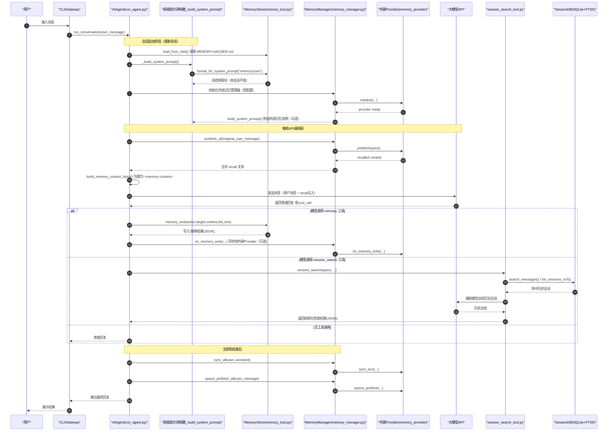

# Hermes 三层记忆系统时序图（中文）

本文展示 Hermes Agent 在一次用户对话中，三层记忆如何参与：

- 第一层：内置持久记忆（`MEMORY.md` / `USER.md`）
- 第二层：外部记忆 Provider（可选，如 Honcho/Mem0）
- 第三层：会话检索记忆（`session_search` + SQLite FTS5）

## 1. 一次对话的主时序

## 1.1 方法中文对照（方法名保留英文，中文解释语义）

- `run_conversation()`：执行一次完整对话回合
- `_build_system_prompt()`：组装系统提示词
- `load_from_disk()`：从磁盘加载记忆文件
- `format_for_system_prompt()`：把记忆格式化为系统提示词片段
- `prefetch_all()`：聚合所有记忆提供器的召回上下文
- `build_memory_context_block()`：把召回内容包装成记忆上下文块
- `memory_tool()`：执行记忆写入/替换/删除动作
- `on_memory_write()`：把内置记忆写入同步通知给外部提供器
- `session_search()`：检索历史会话并生成摘要
- `search_messages()`：在 SQLite FTS5 中检索命中消息
- `list_sessions_rich()`：列出会话元信息（供检索筛选）
- `sync_all()`：把当前轮对话同步到外部记忆提供器
- `queue_prefetch_all()`：为下一轮预取召回任务排队

## 2. 关键机制说明（学习时优先看）

1. 冻结快照机制（内置记忆）
- `MEMORY.md` / `USER.md` 在会话开始时注入系统提示词，之后本会话不热更新。
- 工具写入会立刻落盘，但要到下一会话才反映到系统提示词。

2. API调用时注入机制（外部记忆）
- 外部 Provider 的 recall 不是改系统提示词，而是在每轮 API 调用前临时注入当前用户消息。
- 这样兼顾“可回忆”与“提示词缓存稳定”。

3. 检索记忆与持久记忆分工
- 持久记忆：少量高价值事实，常驻上下文。
- session_search：按需检索全历史（SQLite FTS5 + 摘要），用于“我们之前聊过什么”的召回。

## 3. 对应源码入口（便于跳读）

- 会话初始化内置记忆加载：`run_agent.py`（约 1105 行）
- 系统提示词组装：`run_agent.py`（约 2904 行）
- memory / session_search 工具分发：`run_agent.py`（约 6503 行）
- 内置记忆实现：`tools/memory_tool.py`
- 外部记忆编排：`agent/memory_manager.py`
- Provider 抽象：`agent/memory_provider.py`
- 会话检索工具：`tools/session_search_tool.py`
- SQLite + FTS5：`hermes_state.py`
