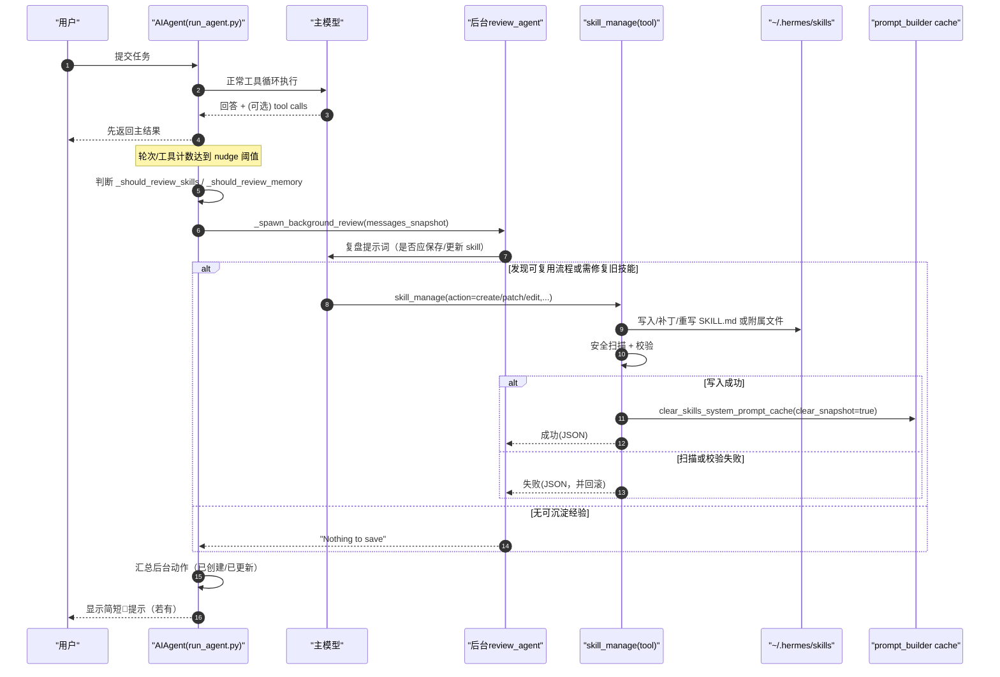

# Hermes 源码解析：自主学习与 Skill 更新机制（中文）

这份文档回答两个问题：

1. Hermes 在源码里如何“自主学习”（自动复盘并决定是否沉淀）？
2. Hermes 在源码里如何“更新 skill”（create/patch/edit）？

---

## 1. 一眼定位：核心文件

- `run_agent.py`
  - 自主学习触发条件（nudge 计数）
  - 后台复盘线程 `_spawn_background_review()`
  - `skill_manage` 工具调用分发
- `tools/skill_manager_tool.py`
  - skill 的 create/edit/patch/delete/write_file/remove_file 真正实现
  - 更新后清理技能缓存
- `agent/prompt_builder.py`
  - 技能索引注入系统提示词
  - 技能缓存与快照（内存 + 磁盘）
- `model_tools.py`
  - 工具发现，确保 `skill_manage` 被注册到工具表面
- `agent/skill_commands.py`
  - `/skill-name` 命令扫描与注入（CLI/Gateway）

---

## 1.1 涉及方法中文对照（方法名不改，仅解释中文语义）

- `run_conversation()`：运行一次完整对话主循环（单轮任务入口）
- `_spawn_background_review()`：启动后台复盘线程（不阻塞主回复）
- `_invoke_tool()`：统一工具调用入口（分发到具体工具）
- `_discover_tools()`：导入并注册工具模块（构建可用工具面）
- `skill_manage()`：管理技能（创建/补丁更新/编辑/删除/写附属文件）
- `_write_file()`：向技能目录写入附属文件（并做安全扫描与回滚）
- `clear_skills_system_prompt_cache()`：清理技能系统提示词缓存（含快照）
- `build_skills_system_prompt()`：构建技能索引提示词（供模型挑选技能）
- `scan_skill_commands()`：扫描技能并生成 `/skill-name` 命令映射
- `_build_skill_message()`：把技能内容组装成注入消息（含支持文件提示）

---

## 2. “自主学习”不是玄学：是可追踪的触发器 + 后台复盘

### 2.1 触发器（何时考虑复盘）

在 `run_agent.py` 中有两套计数：

1. 记忆复盘触发（按用户轮次）
- 位置：`run_agent.py` 约 `7481` 行开始
- 逻辑：`_turns_since_memory` 每个用户回合递增；达到 `memory.nudge_interval`（默认 10）后触发一次 memory review。

2. skill 复盘触发（按工具迭代强度）
- 计数：`run_agent.py` 约 `7721` 行
- 判定：`run_agent.py` 约 `9953` 行
- 逻辑：当本轮工具迭代累计达到 `skills.creation_nudge_interval`（默认 10）且工具可用时，触发 skill review。

3. 计数复位
- 当模型实际调用 `memory` 或 `skill_manage` 时复位计数，避免重复催促。
- 位置：`run_agent.py` 约 `6588-6591`、`6810-6812`。

### 2.2 触发后怎么做：后台复盘线程

- 入口：`run_agent.py` ` _spawn_background_review()`（约 `1954` 行）
- 执行时机：主回答返回后（`run_agent.py` 约 `9970` 行），后台尽力执行（best-effort），不阻塞用户当前回复。
- 机制：
  1. 派生一个 `review_agent`（同模型/同工具面）
  2. 把复盘提示词作为“下一条用户消息”喂给它
  3. 让它自行决定是否调用 `memory` / `skill_manage`
  4. 把成功动作汇总成简短提示（例如“已创建/已更新”）

换句话说，“自主学习”在这里是：
- 定时触发复盘
- 通过同一套工具链把经验写回 memory/skills
- 不打断主任务交互

---

## 3. Skill 更新链路（从触发到落盘）

### 3.1 工具被加载

- `model_tools.py` `_discover_tools()` 会导入：
  - `tools.skill_manager_tool`
- 位置：`model_tools.py` 约 `138-170` 行。

### 3.2 运行时分发到 `skill_manage`

`run_agent.py` 对 agent-level 工具有专门分发：
- 并行/统一入口：`_invoke_tool()`，`skill_manage` 对应分支在 `~6590` 前后路径（同文件中也有顺序执行分支）
- 顺序执行分支中 `skill_manage` 处理：约 `6811` 一带。

### 3.3 `skill_manage` 里真正做的事情

文件：`tools/skill_manager_tool.py`

- 对外入口：`skill_manage(action, name, ...)`（约 `589` 行）
- 支持动作：
  - `create`
  - `patch`（推荐，增量修复）
  - `edit`（整份重写）
  - `delete`
  - `write_file`
  - `remove_file`
- 调度逻辑：约 `605-639` 行。

### 3.4 安全与一致性

`skill_manager_tool.py` 内置了几层防护：

1. 前置校验
- 名称、分类、frontmatter、文件路径、内容大小等。

2. 安全扫描
- 调用 `tools.skills_guard` 扫描潜在风险。
- 若扫描阻断，执行回滚。
- 例：`_write_file()` 中写入后扫描，失败回滚（约 `527-534` 行）。

3. 更新后缓存失效
- 成功更新后调用：
  - `clear_skills_system_prompt_cache(clear_snapshot=True)`
- 位置：`skill_manager_tool.py` 约 `640-644` 行。
- 作用：确保后续系统提示词技能索引读取的是新内容。

---

## 4. Skill 为什么会“越用越改”：系统提示词也在推动

`agent/prompt_builder.py` 的技能提示词会明确要求模型：

- 完成复杂任务后保存 skill
- 使用 skill 发现过时/错误时立即 patch

相关位置：

- `SKILLS_GUIDANCE`：`agent/prompt_builder.py` 约 `164-171` 行
- 技能索引构建：`build_skills_system_prompt()`（约 `533` 行开始）
- 索引缓存：
  - 内存 LRU
  - 磁盘快照 `.skills_prompt_snapshot.json`
  - 见 `~539-543`、`~582` 一带

这意味着“自我改进”不是单点函数，而是：
- 提示词策略驱动 + 工具能力闭环 + 缓存刷新机制

---

## 5. Slash 技能命令与运行时加载

如果你用 `/skill-name`：

- 扫描入口：`agent/skill_commands.py` `scan_skill_commands()`（约 `200` 行）
- 构建技能消息：`_build_skill_message()`（约 `121` 行）
- 支持文件会作为可查看路径提示给模型（`references/templates/scripts/assets`）

这条链路让 skill 在 CLI/Gateway 中可直接被调起，并可继续被 `skill_manage` 更新。

---

## 6. 端到端时序图（自主学习 + Skill 更新）

---

## 7. 实战阅读顺序（建议）

1. `run_agent.py`
- 先看：`7481`、`7721`、`9953`、`9970`、`1954`
- 目标：吃透“何时触发 + 怎么后台执行”

2. `tools/skill_manager_tool.py`
- 先看：`589`、`605`、`615`、`640`
- 目标：吃透“怎么 patch/create + 失败如何回滚”

3. `agent/prompt_builder.py`
- 先看：`164`、`533`、`582`
- 目标：吃透“为什么模型会主动提议更新 skill”

4. `agent/skill_commands.py`
- 先看：`200`、`121`
- 目标：吃透“skill 如何被加载并注入对话上下文”

---

## 8. 一句话总结

Hermes 的“自主学习并更新 skill”本质是一个工程化闭环：
- 触发器定期复盘
- 复盘线程调用同一套工具链
- `skill_manage` 安全落盘并清缓存
- 下一轮通过技能索引/skill命令继续复用

它不是黑盒“自动进化”，而是可读、可测、可控的源码流程。
