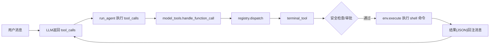

# Hermes-Agent 自动执行终端命令流程（中文）

## 1. 目标

本文说明 Hermes-Agent 在对话中如何“自动执行终端命令”，以及对应代码位置。

## 2. 核心结论

Hermes 不是直接把用户文本当 shell 执行，而是走一条“模型工具调用链路”：

1. 用户发消息
2. 模型决定是否发 `tool_call`
3. Agent 收到 `tool_call` 后分发到对应工具
4. `terminal` 工具在通过安全检查后调用环境执行器
5. 执行结果回注到对话，模型继续推理

## 3. 关键代码定位

- `run_agent.py:6465`：`_execute_tool_calls(...)`
- `run_agent.py:6786`：顺序执行工具调用
- `model_tools.py:459`：`handle_function_call(...)`
- `model_tools.py:517`：`registry.dispatch(...)`
- `tools/terminal_tool.py:1133`：`terminal_tool(...)`
- `tools/terminal_tool.py:1313`：执行前安全检查
- `tools/terminal_tool.py:1487`：调用 `env.execute(...)`
- `tools/terminal_tool.py:1727`：`TERMINAL_SCHEMA`（给模型看的 terminal 工具定义）
- `tools/approval.py:684`：综合审批入口
- `cli.py:7708`、`cli.py:7709`：CLI 注入 sudo/审批回调

## 4. 主流程图

## 5. 流程图逐步解释（中文）

### Step A -> B：用户消息到模型决策

用户输入后，模型先判断这次是否需要工具。

- 如果不需要工具：直接返回自然语言回复。
- 如果需要工具：返回 `tool_calls`（例如 `terminal`、`read_file` 等）。

### Step B -> C：Agent 接管工具调用

`run_agent.py` 在主循环中检测到 `assistant_message.tool_calls`，然后进入工具执行分支（顺序或并发）。

### Step C -> D：进入统一分发入口

每个 tool call 都会进入 `model_tools.handle_function_call(...)`，这里负责：

- 解析工具名和参数
- 做通用容错
- 调到 registry 分发

### Step D -> E：工具注册中心分发

`registry.dispatch(...)` 根据工具名找到注册的 handler。

- `terminal` 工具在 `tools/terminal_tool.py` 里通过 `registry.register(...)` 注册。

### Step E -> F：terminal 工具执行逻辑

进入 `terminal_tool(...)` 后，会做环境解析：

- 本地、Docker、SSH、Modal、Daytona 等
- 由 `TERMINAL_ENV` 和相关环境变量控制

### Step F -> G：安全检查与审批

在真正执行前，terminal 会调用审批系统（`tools/approval.py`）：

- 危险命令检测
- YOLO 模式、会话审批、永久 allowlist、smart approvals
- 在 CLI 下会通过回调弹出审批 UI

### Step G -> H：实际执行 shell

审批通过后，走到 `env.execute(command, ...)`，由对应 backend 执行命令。

- 前台命令：等待结果返回
- 后台命令：返回 `session_id`，后续轮询/通知

### Step H -> I：结果回注模型

执行结果被包装成 JSON 字符串，作为 `tool` 消息追加到上下文。模型读取结果后继续下一轮推理，必要时再发新的工具调用。

## 6. 你该怎么读这段源码（建议顺序）

1. `run_agent.py`（先看 tool_calls 处理主循环）
2. `model_tools.py`（看统一分发）
3. `tools/registry.py`（看注册与 dispatch）
4. `tools/terminal_tool.py`（看执行细节）
5. `tools/approval.py`（看安全与审批）

## 7. 常见误解

- 误解 1：用户一句话会直接变成 shell 执行
  - 实际：必须先经过模型的 `tool_call` 决策
- 误解 2：terminal 一定本机执行
  - 实际：执行环境可切换（local/docker/ssh/modal/daytona）
- 误解 3：危险命令一定执行
  - 实际：会经过审批系统，可能被阻断

