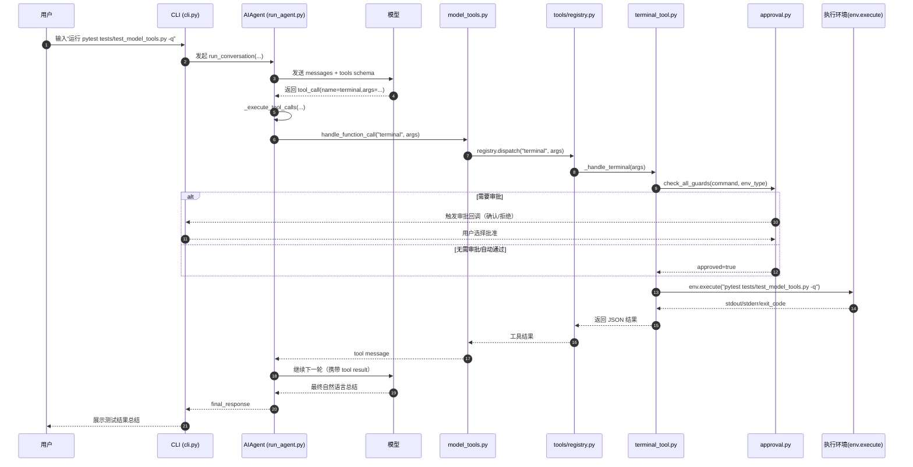

# Hermes-Agent 终端命令自动执行全流程（中文）

## 1. 场景示例

用户输入：

`请运行 pytest tests/test_model_tools.py -q`

## 2. 全流程（文字版）

1. 用户在 CLI 输入消息。  
2. CLI 把消息交给 `AIAgent.run_conversation(...)`。  
3. Agent 请求模型，模型判断这次需要工具，返回 `tool_call(name="terminal", args=...)`。  
4. Agent 进入工具执行分支（顺序或并发）。  
5. `model_tools.handle_function_call(...)` 接管该调用并走 `registry.dispatch(...)`。  
6. 注册中心找到 terminal 工具的 handler（`_handle_terminal`）。  
7. terminal 工具执行前先做安全检查（危险命令检测 + 审批机制）。  
8. 审批通过后调用 `env.execute(...)` 在目标环境执行 shell 命令。  
9. 执行结果（stdout/stderr/exit_code）封装成 JSON 回注到对话。  
10. Agent 再次请求模型，模型基于工具结果输出最终自然语言回复。  

## 3. 时序图（完整）

## 4. 关键代码定位

- `run_agent.py:7358` `AIAgent.run_conversation(...)`
- `run_agent.py:6465` `_execute_tool_calls(...)`
- `run_agent.py:6786` `_execute_tool_calls_sequential(...)`
- `model_tools.py:459` `handle_function_call(...)`
- `model_tools.py:517` `registry.dispatch(...)`
- `tools/terminal_tool.py:1772` `_handle_terminal(...)`
- `tools/terminal_tool.py:1133` `terminal_tool(...)`
- `tools/terminal_tool.py:1313` 执行前安全检查
- `tools/terminal_tool.py:1487` `env.execute(...)`
- `tools/approval.py:684` 审批总入口
- `cli.py:7708` / `cli.py:7709` 注入 sudo/approval 回调

## 5. 你调试时的观察点

- 看模型是否真的返回了 `tool_call`（不是直接文字回复）。
- 看 terminal 工具是否被审批拦截。
- 看 `env.execute(...)` 选择的是哪种 backend（local/docker/ssh 等）。
- 看工具结果是否正确回注到 messages（否则模型拿不到执行输出）。

