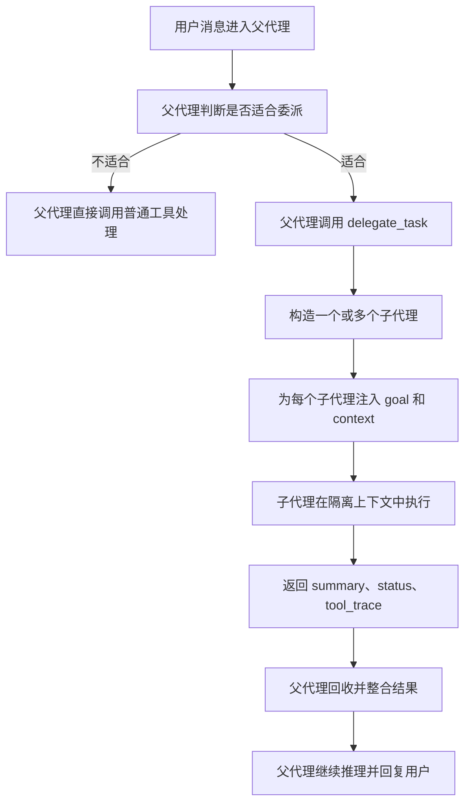

# Hermes 多智能体实现机制解析

## 一、先说结论

Hermes 的 Multi-Agent，并不是多个智能体彼此平等协商、自由讨论的“自治式 Agent Society”，而是一个非常明确的主从式结构：

- 由 **Master Agent（父代理）** 统一调度
- 由 **Subagent（子代理）** 在隔离环境中执行具体子任务
- 最后再把结果摘要回传给父代理
- 由父代理统一整合并对用户输出最终结果

从架构上看，Hermes 的 Multi-Agent 更像一个 **分层委派系统**，而不是一个去中心化的多智能体社会。

一句话总结：

> Hermes 的 multi-agent 不是自治式 agent society，而是一个以父代理为中心的分层委派系统：父代理负责拆解和汇总，子代理在隔离上下文和受限工具集里并行执行，再把压缩后的结果回传给父代理。

---

## 二、为什么 Hermes 需要 Multi-Agent

Hermes 引入 Subagent，主要是为了解决以下几类问题：

- 推理负担重
- 中间过程太长，会污染主上下文
- 任务可以拆成多个相对独立的子问题
- 子问题之间可以并行推进
- 最终只需要子任务摘要，而不需要完整中间细节全部回流到主上下文

这类任务通常包括：

- 调试复杂问题
- 代码审查
- 研究归纳
- 并行研究多个独立方向
- 多轮搜索
- 多文件比对
- 长日志排查
- 大量工具调用

Hermes 使用 Multi-Agent 的根本目的，并不是为了“炫技”，而是为了：

- 降低主代理的上下文压力
- 提升复杂任务处理效率
- 通过并行化缩短整体等待时间
- 用更便宜的子代理执行局部任务，降低整体成本

---

## 三、Hermes 的总体策略

Hermes 的整体策略可以概括为一句话：

> 父代理统一调度，子代理隔离执行，结果摘要回收。

具体来说，整个流程分为六步：

1. 父代理负责拆任务
2. 子代理只拿到“局部目标 + 局部上下文”
3. 子代理上下文彼此隔离
4. 子代理工具权限受限
5. 子代理执行完只把“摘要结果”返回父代理
6. 父代理继续综合、决策，并最终回复用户

这意味着，Hermes 的 Multi-Agent 不是让子代理接管整场对话，而是把它们当作 **廉价、聚焦、可控的 worker** 来使用。

---

## 四、Master Agent 与 Subagent 的角色分工

### 1. 父代理的职责

父代理是整个系统的控制中心，主要负责：

- 理解用户问题
- 判断任务是否适合委派
- 把复杂任务拆成可执行的子任务
- 为每个子任务准备明确的目标和上下文
- 回收并整合子代理的执行结果
- 决定最终如何对用户作答

所以父代理更像一个 **Orchestrator（调度者）**。

### 2. 子代理的职责

子代理的职责非常聚焦：

- 接收父代理分配的一个明确任务
- 在隔离的上下文里执行任务
- 使用受限工具集完成工作
- 最后输出一个简洁摘要返回给父代理

所以子代理更像一个 **Focused Worker（聚焦执行者）**。

---

## 五、Hermes 的核心设计哲学：隔离上下文

Hermes 的一个非常重要的设计理念是：

> 子代理不知道父代理的完整会话历史。

每次创建子代理时，它不会继承父代理整段对话，只会拿到：

- 当前子任务的目标
- 必要的上下文说明
- 一组受限的工具权限

也就是说，子代理不是“复制一个父代理继续聊”，而是“新开一个聚焦任务会话”。

这带来一个非常重要的约束：

> 所有对子代理重要的信息，都必须显式传递。

例如：

- 文件路径
- 错误日志
- 限制条件
- 目标范围
- 任务背景

这些都必须通过 `context` 明确传给子代理，而不是指望它自己从父会话里“继承理解”。

这也是 Hermes Multi-Agent 的核心哲学之一：

> 显式传递上下文，避免隐式共享历史。

这样设计的好处是：

- 子代理不会被父会话历史污染
- 上下文更短、更干净
- 每个子代理都能高度聚焦
- 父代理主上下文不会被子任务细节挤爆

---

## 六、为什么它能减少上下文污染

在复杂任务中，真正占用大量 token 的，往往不是最终结论，而是中间过程，例如：

- 连续搜索和筛选
- 多轮文件阅读
- 多次日志排查
- 多个工具调用的往返
- 调试过程中的试错轨迹

如果这些中间轨迹都留在父代理上下文里，主代理很快就会遇到两个问题：

1. 上下文被大量中间细节挤占
2. 后续任务更容易触发压缩，甚至影响主问题的推理质量

而使用子代理后，这些长过程会被“包”进子代理自己的上下文中。父代理最终只拿到一个摘要结果，因此主上下文只保留高价值信息，而不会保留所有中间噪音。

所以从本质上说，Hermes 的 Multi-Agent 是一种：

> 上下文隔离机制

---

## 七、Subagent 是如何被触发的

Hermes 并没有写死“遇到某类任务就一定开子代理”，而是把 delegation 做成了一个正式工具：

- 工具名：`delegate_task`
- 入口位置：`tools/delegate_tool.py`
- 主循环调用位置：`run_agent.py`

这意味着：

- 是否使用 subagent，首先由模型自己判断
- 一旦模型决定委托，就会像调用其他工具一样调用 `delegate_task`

这和普通工具调用的区别在于：

- 普通工具返回的是工具执行结果
- `delegate_task` 返回的是“另一个代理完成子任务后的摘要结果”

可以把它理解成：

- `read_file` 是“去读文件”
- `terminal` 是“去执行命令”
- `delegate_task` 是“去叫一个小代理单独做这件事”

因此，Hermes 的 subagent 触发逻辑，本质上是：

> 模型做语义决策，框架做安全约束。

---

## 八、什么情况下适合使用 Subagent

Hermes 并不是看到复杂任务就一定启用子代理，而是更适合在以下情况下使用：

- 任务推理负担比较重
- 中间过程很长，容易挤占主上下文
- 可以拆成多个相对独立的子问题
- 子问题之间可以并行推进
- 最终只需要子任务摘要，而不需要完整细节回流到主上下文

更具体一点，典型适用场景包括：

- 调试
- 代码审查
- 研究归纳
- 并行研究多个独立方向
- 多轮搜索
- 多文件比对
- 长日志排查
- 大量工具调用

这些任务的共同点是：

- 中间过程很长
- 结论比过程更重要
- 局部工作可以拆出去独立完成

---

## 九、什么情况下不适合使用 Subagent

以下几类任务通常不适合使用 `delegate_task`：

- 纯机械执行型任务
- 只需要一次工具调用的任务
- 需要和用户交互澄清的任务
- 任务过小，拆分成本大于收益
- 任务强依赖上一步结果，不适合并行

例如：

- 跑一条命令
- 改一个文件
- 做一次简单查询
- 需求本身还没澄清清楚

这类任务通常由父代理直接调用普通工具更高效。

---

## 十、子代理是怎么创建的

子代理的创建核心在 `tools/delegate_tool.py` 的 `_build_child_agent()`。

创建时，它不是简单复制父代理，而是做了“受控继承 + 能力裁剪”：

- 生成独立的 system prompt
- 只注入当前任务的 `goal` 和 `context`
- 分配独立的工具集
- 默认跳过 memory
- 默认跳过 context files
- 给子代理单独的迭代预算
- 把子代理进度回传给父代理显示层

所以子代理更像一个“新开的聚焦执行体”，而不是“父代理的完整分身”。

---

## 十一、子代理的上下文为什么必须显式传递

Hermes 的子代理默认不知道父代理的完整历史，因此：

- 文件路径必须显式传
- 错误日志必须显式传
- 约束条件必须显式传
- 任务边界必须显式传

这就是为什么在 Hermes 里，给子代理写 `goal/context` 的质量，几乎直接决定了子代理完成任务的质量。

如果父代理传递的信息不完整，子代理就会：

- 误判任务边界
- 找不到正确文件
- 不能复现问题
- 做出过度假设

所以 Hermes 的 subagent 机制，本质上依赖一种很强的设计哲学：

> 任务要拆得清楚，上下文要传得明确。

---

## 十二、Subagent 不是无限递归的

Hermes 并不允许子代理无限继续生成新的子代理。

它有明确的深度控制策略：

- 父代理深度为 `0`
- 子代理深度为 `1`
- 再往下就拒绝继续派生

也就是说，Hermes 采用的是一种浅层 delegation 策略：

- 允许父代理派发子代理
- 不鼓励子代理继续生成自己的子代理树

这样做的目的，是避免形成不可控的递归智能体系统，使整个调度逻辑始终清晰和可控。

---

## 十三、任务执行模式：单任务串行与多任务并行

Hermes 的子代理执行分为两种模式：

### 1. 单任务模式

如果只委派一个任务，就由一个子代理直接执行，整体是串行的。

### 2. 批量任务模式

如果任务可以拆成多个独立子任务，Hermes 会开启多个子代理并行执行，使用多线程方式调度。

默认情况下，并发上限是 **3 个子代理**。

并发上限存在的原因包括：

- 控制模型调用成本
- 控制系统资源消耗
- 防止模型一轮里过度派生任务
- 保证父代理仍然能理解和整合返回结果

所以 Hermes 的策略不是“能并行就无限并行”，而是：

> 有限并发、受控并行。

---

## 十四、为什么要限制子代理的工具权限

Hermes 的子代理不是一个“缩小版父代理”，它的执行范围被明确限制。

默认被禁止的工具包括：

- `delegate_task`
- `clarify`
- `memory`
- `send_message`
- `execute_code`

这么设计有几个很明确的原因。

### 1. 禁止 `delegate_task`

防止子代理再继续派生新的子代理，避免递归失控。

### 2. 禁止 `clarify`

防止多个子代理直接与用户交互，导致对话混乱。Hermes 规定，所有用户沟通都必须由父代理统一负责。

### 3. 禁止 `memory`

防止多个子代理并发写入长期记忆，把局部结论误写成全局事实，造成记忆污染。

### 4. 禁止 `send_message`

防止子代理直接产生跨平台副作用，比如发送消息、触发外部通知等。

### 5. 禁止 `execute_code`

Hermes 希望子代理更像推理型 worker，而不是脚本执行器，避免它绕开推理过程，直接用程序化方式无约束扩展执行范围。

所以，Hermes 的子代理本质上是：

> 一个受限的执行单元，而不是完整自主体。

---

## 十五、为什么父代理适合强模型，子代理适合弱模型

Hermes 的 Multi-Agent 还有一个非常实用的工程策略：

> 父代理用更强的模型，子代理用更便宜、更快的模型。

原因是：

- 父代理负责理解用户需求、拆任务、综合结果，推理层级更高
- 子代理只负责某个局部任务，目标明确、上下文更小、任务更聚焦

所以，从成本优化角度看，非常适合：

- 让父代理使用高质量模型
- 让子代理使用较便宜、较快的模型
- 把一个大任务拆成多个廉价 worker 并行处理

这使 Hermes 的 Multi-Agent 不只是“功能增强”，更是一种：

> 成本优化型架构

---

## 十六、子代理为什么不直接写 Memory

Hermes 在记忆策略上非常克制。

子代理不会直接写长期记忆，原因是：

- 子代理处理的是局部任务
- 它看到的信息是不完整的
- 它的结论可能只是阶段性结果
- 多个子代理并发写记忆，容易带来噪音

所以 Hermes 采取的是：

- 子代理不直接写 memory
- 任务结束后，由父代理接收子代理摘要
- 父代理再决定“这次委派学到了什么”
- 最终由父代理或 memory manager 决定是否纳入长期记忆

这相当于：

> 子代理负责产出观察，父代理负责记忆决策。

这样可以明显减少记忆污染，提高长期记忆质量。

---

## 十七、整个调用流程可以怎么理解

Hermes 的 Multi-Agent 主流程可以概括成这样：

这个流程里最关键的点有三个：

- 拆任务的是父代理
- 干活的是子代理
- 对用户负责的仍然是父代理

---

## 十八、Hermes 的 Multi-Agent 本质总结

Hermes 的 Multi-Agent，本质上不是一个“多智能体社会”，而是一个：

> 以父代理为中心的分层委派系统

它的特点可以总结为：

- 由父代理统一判断是否委派
- 由父代理负责拆任务和整合结果
- 子代理在隔离上下文中执行局部任务
- 子代理工具权限受限，避免越界
- 子代理之间可以有限并发
- 子代理不直接污染长期记忆
- 父代理最终统一输出给用户

因此，Hermes 的 Multi-Agent 更像一个工程化、可控、重视上下文成本和执行边界的多代理体系。

---

## 十九、3 分钟讲完版

如果让我用 3 分钟介绍 Hermes 的 Multi-Agent，我会这样讲：

Hermes 的 Multi-Agent，本质上是一个主从式的分层委派系统，而不是多个智能体自由协商的自治社会。它的核心结构是 Master Agent 和 Subagent：父代理负责理解用户需求、判断任务是否适合拆分、把任务拆成多个子任务，并在最后统一整合结果；子代理则只负责在隔离上下文里完成某个局部目标。

Hermes 之所以要这样设计，主要是为了解决三类问题：第一类是推理负担重，第二类是中间过程太长，容易污染主上下文，第三类是任务本身可以拆成多个独立子问题并行推进。像调试、代码审查、研究归纳、多轮搜索、多文件比对、长日志排查、大量工具调用，这些都很适合派给子代理处理。

它的关键思想是“父代理统一调度，子代理隔离执行，结果摘要回收”。也就是说，父代理负责拆任务，子代理只拿到局部目标和显式上下文，彼此之间不共享完整会话历史，执行完成后只把摘要结果返回给父代理，而不会把全部中间过程回灌到主上下文中。这样一来，主代理的上下文就不会被大量中间细节挤爆。

Hermes 的子代理不是无限递归的，它有严格的边界控制。子代理不能再继续调用 `delegate_task`，也不能调用 `clarify`、`memory`、`send_message`、`execute_code` 这些工具。这样做是为了防止递归失控、防止多个子代理同时和用户交互、防止污染长期记忆，以及防止子代理执行范围越界。

在执行方式上，Hermes 支持单任务串行，也支持多任务并行。默认并发上限是 3 个子代理。它不是追求无限并行，而是追求受控并行。另一个很重要的工程策略是：父代理适合用更强的模型，因为它负责理解和汇总；子代理适合用更便宜、更快的模型，因为它们只做局部、聚焦的工作。这样就可以把一个大任务拆成多个廉价 worker 并行处理，在保证质量的同时降低整体成本。

最后一点，Hermes 不让子代理直接写 memory，而是让父代理决定“这次委派学到了什么”再交给记忆系统。这样可以显著减少噪音，提高长期记忆质量。

所以一句话总结就是：Hermes 的 Multi-Agent 不是自治式 agent society，而是一个以父代理为中心、强调上下文隔离、受限执行和结果摘要回收的工程化多代理系统。
