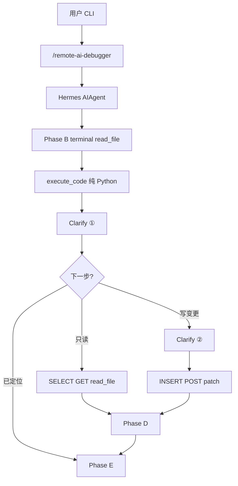

# Remote AI Debugger — 设计与实现说明

本文档由 Cursor 计划整理入仓，与 [`SKILL.md`](../../skills/software-development/remote-ai-debugger/SKILL.md) v1.2.0 及 [`REQUIREMENTS.zh.md`](REQUIREMENTS.zh.md) 对齐。

## 目标

在 SSH 远程环境中，对照 **预期 vs 实际**，自动收集证据、分类调用工具、输出根因报告。

- **纯内部逻辑** → `execute_code` 最小复现（远程 Python）
- **外部依赖** → MCP 或 `terminal` 只读探测；写操作需 Clarify ②
- **第一版** → Skill + Profile，**不改** `run_agent.py`

## 架构



### 复用的 Hermes 组件

| 能力 | 代码位置 |
|------|----------|
| SSH 终端 | [`tools/terminal_tool.py`](../../tools/terminal_tool.py) |
| 远程 execute_code | [`tools/code_execution_tool.py`](../../tools/code_execution_tool.py) `_execute_remote` |
| MCP | [`tools/mcp_tool.py`](../../tools/mcp_tool.py) |
| clarify | [`tools/clarify_tool.py`](../../tools/clarify_tool.py) |
| Skill 注入 | [`agent/skill_commands.py`](../../agent/skill_commands.py) |
| 系统化调试 | [`skills/.../systematic-debugging/SKILL.md`](../../skills/software-development/systematic-debugging/SKILL.md) |

### 三层运行时

| 层 | 位置 | 职责 |
|----|------|------|
| Agent | 本机 | LLM 选工具、clarify 串行 |
| SSH | 远程 Linux | terminal、read_file、script.py |
| RPC 轮询 | 本机线程 | 远程 `hermes_tools` 请求代理回 SSH |

## Clarify 门禁（v1.2.0）

详见 [`REQUIREMENTS.zh.md`](REQUIREMENTS.zh.md)。

| 档位 | 时机 |
|------|------|
| **无入口 clarify** | Phase A 只解析用户消息 |
| **Clarify ①** | 每次纯 `execute_code` 后必做 |
| **Clarify ②** | **仅**写/变更：DB DML、HTTP POST/PUT、patch、restart、MCP 写 |
| **不需 Clarify ②** | SELECT、GET、read_file、tail 日志 |

## 五阶段工作流

| 阶段 | 内容 |
|------|------|
| A | 解析 expected/actual/scope，不 clarify |
| B | 只读侦察：terminal、read_file、search_files |
| C1 | 分类：纯内部 / 外部 / 混合 |
| C2 | 纯 execute_code + Clarify ① + 调试契约 |
| C3 | 只读外部探测直接执行；写操作 Clarify ② |
| D | 假设验证循环 |
| E | 根因报告 Markdown；用户要求才 patch |

## 仓库内文件清单

```
skills/software-development/remote-ai-debugger/SKILL.md   # Agent 工作流（权威）
examples/remote-debugger/
  README.zh.md              # 快速开始
  PLAN.zh.md                # 本文档
  REQUIREMENTS.zh.md        # 需求对齐结论
  config.yaml.example       # Profile 模板
  mcp_servers.example.yaml  # MCP 片段
  .env.example              # SSH / API Key 模板
  install-profile.ps1       # Windows 安装脚本
  install-profile.sh        # Linux/macOS 安装脚本
  fixtures/repro_bug.py     # 冒烟用已知 bug
tests/skills/test_remote_ai_debugger_skill.py               # SKILL 内容检查
```

用户 Profile 目录（本机，不入仓）：`~/.hermes/profiles/remote-debugger/`

## 安装与验证

```powershell
# 在 hermes-agent 仓库根目录
.\examples\remote-debugger\install-profile.ps1
# 编辑 ~/.hermes/profiles/remote-debugger/.env 中的 TERMINAL_SSH_*
hermes -p remote-debugger doctor
pytest tests/skills/test_remote_ai_debugger_skill.py -q -o addopts=
```

### 冒烟场景

**A — off-by-one：** 远程 `/tmp/repro_bug.py`，预期 Clarify ①、无 Clarify ②。

**B — Postgres 混合：** Clarify ① → 只读 SELECT（无 Clarify ②）→ 报告；仅 UPDATE 时才 Clarify ②。

## 不在第一版范围

- AST/调用图工具
- 非 Python 自动 transpile
- Gateway/Telegram 入口
- run_agent 硬编码状态机

## 已知限制

- 无代码级 clarify 门禁，依赖 Skill Iron Rules
- Windows 本机 local `execute_code` 不可用，需 SSH Profile
- MCP 未配置时用 `terminal` + `psql`/`curl` fallback
