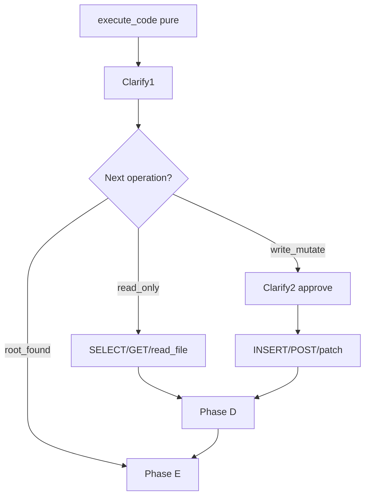

# Remote AI Debugger Profile

基于 Hermes Agent 的远程 SSH 调试 Profile + Skill，用于对照**预期 vs 实际**定位根因。

## 组件

| 组件 | 路径 |
|------|------|
| Skill | `skills/software-development/remote-ai-debugger/SKILL.md` |
| Profile 示例 | `examples/remote-debugger/config.yaml.example` |
| MCP 示例 | `examples/remote-debugger/mcp_servers.example.yaml` |
| 用户 Profile | `~/.hermes/profiles/remote-debugger/` |

## 快速安装

### 1. 创建 Profile

```powershell
# Windows PowerShell
$profileDir = "$env:USERPROFILE\.hermes\profiles\remote-debugger"
New-Item -ItemType Directory -Force -Path $profileDir

Copy-Item examples\remote-debugger\config.yaml.example "$profileDir\config.yaml"
Copy-Item examples\remote-debugger\mcp_servers.example.yaml "$profileDir\mcp_servers.fragment.yaml"
```

编辑 `config.yaml`：

- `terminal.cwd` → 远程项目根目录
- `model` / `custom_providers` → 你的 API 配置
- 将 `mcp_servers.fragment.yaml` 中需要的 server 合并进 `config.yaml`

### 2. 配置 SSH（Profile `.env`）

在 `~/.hermes/profiles/remote-debugger/.env` 写入：

```bash
TERMINAL_ENV=ssh
TERMINAL_SSH_HOST=192.168.1.100
TERMINAL_SSH_USER=ubuntu
TERMINAL_SSH_PORT=22
TERMINAL_SSH_KEY=~/.ssh/id_rsa

# 从 default profile 复制 API Key
DEEPSEEK_API_KEY=sk-...
```

确保本机可免密或密钥登录：

```bash
ssh -i ~/.ssh/id_rsa ubuntu@192.168.1.100 echo ok
```

### 3. 验证

```bash
hermes -p remote-debugger doctor
```

应看到 SSH 连接检查通过（需正确配置 `TERMINAL_SSH_*`）。

### 4. 启动调试

```bash
hermes -p remote-debugger
```

在 CLI 中：

```
/remote-ai-debugger 预期: API 返回 200 实际: 返回 500 路径: /opt/app 服务: myapp
```

## 工作流摘要（双 clarify 门禁）

Skill 通过 **prompt 编排** 约束 Agent，不修改 `run_agent.py`。



| 阶段 | 工具 | clarify |
|------|------|---------|
| **Phase A** | 解析 expected/actual/scope | **不**在入口 clarify |
| **Phase B** | `terminal`, `read_file`, `search_files` | 无 |
| **Phase C2** | `execute_code` 纯脚本 | **Clarify ① 必做** |
| **Phase C3** | 外部写/变更（INSERT/POST/patch 等） | **Clarify ② 仅写操作** |
| **Phase C3 只读** | SELECT/GET/MCP 只读/`psql SELECT` | **无需** Clarify ② |
| **Phase D/E** | 假设验证 / 报告 | 修复 patch 需 Clarify ② |

**Clarify ② 判定（摘要）：**

| 需 Clarify ② | 不需 Clarify ② |
|--------------|----------------|
| DB INSERT/UPDATE/DELETE | DB SELECT |
| HTTP POST/PUT/PATCH/DELETE | HTTP GET |
| write_file / patch / restart | read_file / tail 日志 |
| MCP 写操作 | MCP 只读 probe |

**调试契约**（Clarify ① 后）：

```markdown
## 调试契约
- expected: ...
- actual: ...
- repro_output: ...
- scope: ...
- rpc_plan: ...        # 仅在有写/变更计划时填写
```

## execute_code 两种模式

| 模式 | 脚本 | `tool_calls_made` | clarify |
|------|------|-------------------|---------|
| 纯复现 | 仅 inline + print | 0 | Clarify ① |
| RPC 只读 | `hermes_tools.read_file` | >0 | 无 Clarify ② |
| RPC 写 | `write_file` / mutating terminal | >0 | Clarify ② 先批准 |

## Windows 说明

本机 Windows 上 local `execute_code` 不可用，但 **SSH Profile 下 `execute_code` 在远程 Linux 执行**，与 `terminal` 一致。

## 冒烟测试

### 场景 A：纯内部 off-by-one

在远程主机放置：

```bash
# /tmp/repro_bug.py
def add(a, b):
    return a + b + 1  # off-by-one bug

print(add(2, 2))  # prints 5, expected 4
```

```
/remote-ai-debugger 预期: add(2,2)==4 实际: 输出 5 路径: /tmp repro: python3 /tmp/repro_bug.py
```

**通过标准：** Clarify ① 有；**无** Clarify ②；报告定位 `+ 1`；`tool_calls_made: 0`。

### 场景 B：Postgres 混合

```
/remote-ai-debugger 预期: 订单 paid 实际: pending 路径: /opt/shop 服务: order-api
```

**通过标准：**

- 侦察 → 纯 execute_code → Clarify ①
- 只读 `SELECT` via MCP 或 `psql` → **无 Clarify ②**
- 报告含 DB 查询结果
- 若 Agent 提议 `UPDATE` 验证 → 才出现 Clarify ②

未配置 MCP 时 Agent 应直接用 `terminal` + `psql SELECT`（仍无需 Clarify ②）。

## 相关文档

- [Native MCP Skill](../../skills/mcp/native-mcp/SKILL.md)
- [Systematic Debugging Skill](../../skills/software-development/systematic-debugging/SKILL.md)
- Hermes SSH 配置：`website/docs/user-guide/configuration.md`（TERMINAL_SSH_*）
