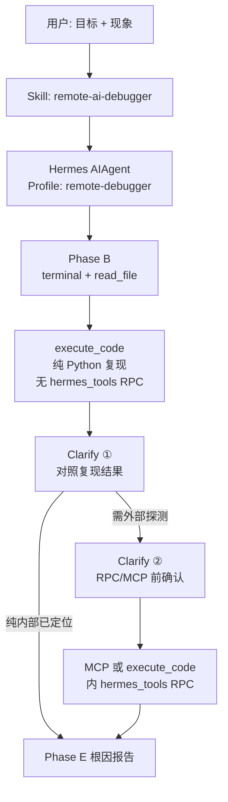
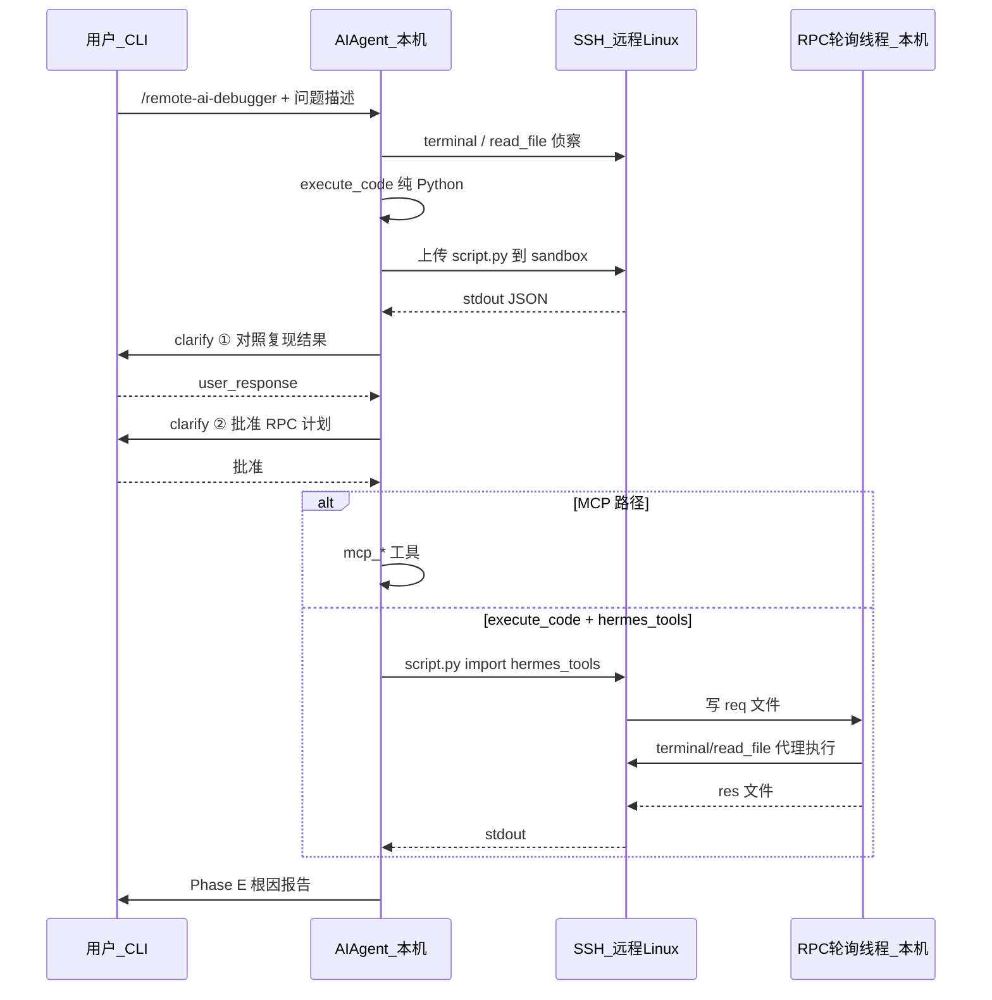
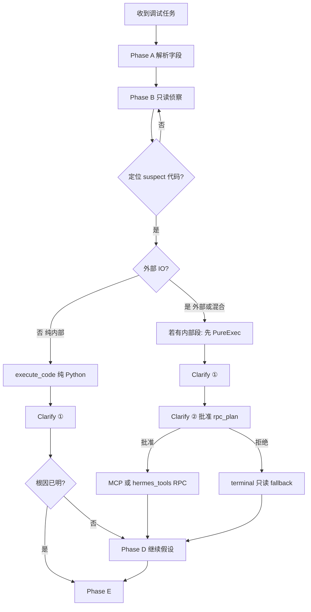

# 远程 AI Debugger 智能体（Hermes Skill + Profile）

## 目标

构建一个可重复使用的 **远程调试智能体**：你在 SSH 目标机上给出 **预期结果 vs 实际结果**，Agent 自动：

1. 在远程环境收集证据（日志、进程、配置、代码路径）
2. **分类调用**：无外部依赖的逻辑 → 转写为 **Python 最小复现脚本 + 终端命令** 在远程执行；有外部依赖（DB、HTTP API、消息队列等）→ 走 **MCP 工具** 探测
3. 输出 **根因报告**：哪一步、哪个变量/返回值导致与目标不一致

第一版范围：**Skill + Profile 配置**，不修改 [`run_agent.py`](d:\BaiduDownLoad\多屏协同\hermes-agent\run_agent.py) 核心循环。

---

## 架构（复用 Hermes 现有能力）



**关键现有实现（无需重写）：**

| 能力 | 位置 | 远程 SSH 行为 |
|------|------|----------------|
| SSH 终端 | [`tools/terminal_tool.py`](d:\BaiduDownLoad\多屏协同\hermes-agent\tools\terminal_tool.py) | `TERMINAL_ENV=ssh` + `TERMINAL_SSH_*` |
| 远程 Python 沙箱 | [`tools/code_execution_tool.py`](d:\BaiduDownLoad\多屏协同\hermes-agent\tools\code_execution_tool.py) | `env_type == "ssh"` 时在远程跑 `execute_code`（**Windows 本机也可**） |
| MCP 外部调用 | [`tools/mcp_tool.py`](d:\BaiduDownLoad\多屏协同\hermes-agent\tools\mcp_tool.py) | `~/.hermes/config.yaml` → `mcp_servers` |
| 调试工具集 | [`toolsets.py`](d:\BaiduDownLoad\多屏协同\hermes-agent\toolsets.py) `debugging` | terminal + file + web |
| 用户澄清 | [`tools/clarify_tool.py`](d:\BaiduDownLoad\多屏协同\hermes-agent\tools\clarify_tool.py) | **两档 clarify**（见下节） |
| 系统化调试 | [`skills/software-development/systematic-debugging/SKILL.md`](d:\BaiduDownLoad\多屏协同\hermes-agent\skills\software-development\systematic-debugging\SKILL.md) | 作为关联 skill，禁止未查根因就改代码 |

---

## clarify 两档门禁（复用已有工具，不新写代码）

Hermes **已具备** [`clarify`](d:\BaiduDownLoad\多屏协同\hermes-agent\tools\clarify_tool.py) 与 [`execute_code`](d:\BaiduDownLoad\多屏协同\hermes-agent\tools\code_execution_tool.py)（含 SSH 远程 + `hermes_tools` RPC）。本方案只规定 **何时调用 clarify**，不改工具实现。

### 与旧方案差异

| 旧设想 | 新设想（你的要求） |
|--------|-------------------|
| 入口先 clarify 结构化 expected/actual | **不在入口强制 clarify**；用户首条消息能解析则直接进入侦察 |
| 一次 clarify 补齐字段 | **两次 clarify**，分别绑在 execute_code 结果与 RPC 前 |

### Clarify ① — execute_code 纯复现之后

**时机：** Phase C 判定为**纯内部逻辑**（或混合路径中「先隔离内部」），已用 `execute_code` 跑完 **不含 `from hermes_tools import ...`** 的最小复现脚本。

**之前允许：** Phase B 只读侦察（`terminal` / `read_file` / `search_files`），用于定位 suspect 代码。

**之后必须：** 把 `execute_code` 的 **stdout / 打印结果** 摘要给用户，再调用 `clarify`：

| 目的 | 示例 question / choices |
|------|-------------------------|
| 复现是否与用户看到的 actual 一致 | 「脚本输出为 `{output}`，与您描述的现象是否一致？」 |
| 补齐 expected（若首条未写清） | 「预期结果应是？」（开放题） |
| 是否继续深挖 | choices: `继续查根因` / `复现不对，我补充现象` / `已足够，出报告` |

**硬规则：** Clarify ① 完成前，不得进入 Clarify ② 所管的 RPC/MCP 路径。

**execute_code 脚本要求（Clarify ① 专用）：**

```python
# 仅 inline 逻辑 + print，禁止 import hermes_tools
def suspect_logic(...):
    ...
print("result:", ...)
print("expected:", "...")  # 来自用户或待 Clarify ① 补齐
```

### Clarify ② — RPC / MCP 调用之前

**时机：** 即将发生下列任一 **外部/RPC** 动作之前：

| 类型 | 示例 |
|------|------|
| **MCP** | `mcp_postgres_*`、`mcp_fetch_*` 等 |
| **execute_code 内 RPC** | 脚本内 `from hermes_tools import terminal, read_file, web_search`（经 UDS/文件 RPC 回调父进程） |
| **混合路径** | 先用 MCP 固定 DB/API 状态，再跑带 mock 的复现 |

**clarify 内容：**

| 目的 | 示例 |
|------|------|
| 确认探测范围 | 「将只读查询 Postgres 表 `orders`，是否继续？」 |
| 确认 MCP server | choices: 映射表中的 server / `取消，仅用 terminal` |
| 敏感操作 | 「将执行 `curl` 访问内网 API，只读 GET，是否批准？」 |

**硬规则：** 用户通过 Clarify ② 之前，**禁止** MCP 调用、**禁止** execute_code 脚本 import `hermes_tools`。

### 调试契约（Clarify ① 之后写入上下文）

Clarify ① 结束后输出（供 Phase D/E 使用）：

```markdown
## 调试契约
- expected: ...        # Clarify ① 或首条消息
- actual: ...          # 用户描述 + 与复现输出对照
- repro_output: ...    # execute_code stdout 摘要
- scope: ...
- rpc_plan: ...        # Clarify ② 批准后的 MCP/RPC 计划（若有）
```

### Profile 要求

`platform_toolsets.cli` 必须同时包含 **`clarify`** 与 **`code_execution`**（示例 config 已含）。

---

## 交付物

### 1. 新建 Skill：`remote-ai-debugger`

路径建议：[`skills/software-development/remote-ai-debugger/SKILL.md`](d:\BaiduDownLoad\多屏协同\hermes-agent\skills\software-development\remote-ai-debugger\SKILL.md)

Skill 正文需定义 **固定工作流**（模型必须按阶段执行）：

**Phase A — 解析用户目标（无 clarify）**

- 从 `/remote-ai-debugger` 首条消息提取 `expected` / `actual` / `scope`（能解析则记录，缺失字段留到 **Clarify ①** 补齐）
- 输出初步调试意图，**不**在此阶段调用 clarify

**Phase B — 远程侦察（仅 terminal + file）**

- `terminal`：`pwd`、`git status`、`git log -5`、服务状态、相关日志 tail
- `read_file` / `search_files`：定位入口函数、错误栈对应源码
- 禁止此阶段直接改生产代码

**Phase C — 调用分类（Skill 规则，非静态分析器）**

对可疑代码路径，Agent 逐函数/语句判断：

| 类型 | 判定 | 动作 |
|------|------|------|
| **纯内部** | 无 HTTP/DB/子进程/第三方 SDK | **execute_code 纯 Python 复现** → **Clarify ①** → 若已定位则 Phase E，否则 Phase D |
| **外部依赖** | 调 API、DB、MQ、外部 CLI | 先完成 Clarify ①（若有内部部分）→ **Clarify ②** → MCP 或带 `hermes_tools` 的 execute_code |
| **混合** | 内部逻辑 + 外部 IO | 纯 Python 复现 + Clarify ① → Clarify ② 批准 MCP/RPC → 再隔离内部 |

**Phase C2 — Clarify ①（execute_code 结果后，必做）**

- 展示复现脚本 stdout
- 调用 `clarify` 对照 actual / 补齐 expected / 确认是否继续

**Phase C3 — Clarify ②（RPC/MCP 前，条件必做）**

- 仅当需要 MCP 或 `hermes_tools` RPC 时触发
- 用户批准后才执行外部探测

**Phase D — 验证循环**

- 每个假设：`假设 → 远程执行 → 观察输出 → 与 expected 对比`
- 使用 [`systematic-debugging`](d:\BaiduDownLoad\多屏协同\hermes-agent\skills\software-development\systematic-debugging\SKILL.md) 铁律：**未定位根因前不得提交 fix**
- 复杂子问题可用 `delegate_task`（toolsets 限制为 debugging + file，禁止递归 delegate）

**Phase E — 根因报告（固定 Markdown 模板）**

```markdown
## 目标差异
- 预期：...
- 实际：...

## 根因
- 位置：文件:行 / 函数
- 机制：...

## 证据
- 命令/脚本输出摘要
- MCP 调用结果摘要

## 修复建议（可选，需用户确认后再改）
```

Skill 内附带 **MCP 映射表示例**（用户按环境改写）：

```yaml
# 示例：写入 Skill 或 Profile README
postgres: mcp_postgres_query
http_api: mcp_fetch_get / curl via terminal
redis: mcp_redis_get
```

---

### 2. 新建 Profile：`remote-debugger`

在 `~/.hermes/profiles/remote-debugger/` 下配置（仓库内提供示例 [`examples/remote-debugger/`](d:\BaiduDownLoad\多屏协同\hermes-agent\examples\remote-debugger/)）：

**`config.yaml` 要点：**

```yaml
terminal:
  backend: ssh          # 或 env: TERMINAL_ENV=ssh
  cwd: /path/on/remote  # 远程项目根目录
  persistent_shell: true

# platform_toolsets.cli 必须含 clarify + code_execution（双 clarify 编排）
platform_toolsets:
  cli:
    - debugging
    - code_execution
    - clarify          # Clarify ① / ②
    - memory
    - session_search
    - skills
    - delegation

mcp_servers:
  # 按远程服务配置，见 examples/remote-debugger/mcp_servers.example.yaml

compression:
  enabled: true
  threshold: 0.50

memory:
  memory_enabled: true
  user_profile_enabled: true
```

**`.env` 要点（Profile 目录或 `~/.hermes/.env`）：**

```bash
TERMINAL_ENV=ssh
TERMINAL_SSH_HOST=<远程 IP/域名>
TERMINAL_SSH_USER=<用户>
TERMINAL_SSH_PORT=22
TERMINAL_SSH_KEY=~/.ssh/id_rsa
# 主模型 API Key（DeepSeek 等）保持现有配置
```

启动方式：

```bash
hermes -p remote-debugger
# 会话内：
/remote-ai-debugger 预期: API 200 实际: 500 路径: /opt/app
# Agent 流程：Phase B 侦察 → execute_code 纯复现 → Clarify ① →（如需）Clarify ② → RPC/MCP → 报告
```

---

## 实现细节：架构如何落地（不改 run_agent.py）

第一版 **100% 靠 Skill 编排 + Profile 配置**。Hermes 已有工具链完整，缺的是「何时调用哪个工具」的硬规则。

### 三层运行时模型



| 层 | 进程位置 | 职责 |
|----|----------|------|
| **Agent 循环** | Windows 本机 | LLM 决策、调用 clarify/execute_code/mcp |
| **SSH 终端后端** | 远程 Linux | `terminal`、`read_file` 同步、`execute_code` 脚本执行 |
| **RPC 轮询** | 本机线程 | [`code_execution_tool._execute_remote`](d:\BaiduDownLoad\多屏协同\hermes-agent\tools\code_execution_tool.py) 读远程 `req_*` 文件，在本机执行 `terminal`/`read_file` 等，写回 `res_*` |

**关键：** 即使脚本在远程跑，`hermes_tools.terminal()` 的实际命令仍由 **本机 Agent 经 SSH 代理** 执行——这就是 Clarify ② 要门禁的原因（会触发跨边界 IO）。

### execute_code 的两种模式（Skill 必须区分）

| 模式 | 脚本特征 | 何时用 | Clarify |
|------|----------|--------|---------|
| **纯复现** | 无 `import hermes_tools`，仅 inline 逻辑 + `print` | Phase C 隔离内部逻辑 | **① 之后必做** |
| **RPC 复现** | `from hermes_tools import terminal, read_file, ...` | 需在脚本内循环调工具、读多文件 | **② 之前必做** |

远程 SSH 路径（[`_execute_remote`](d:\BaiduDownLoad\多屏协同\hermes-agent\tools\code_execution_tool.py) L706+）：

1. 本机生成 `hermes_tools.py`（file-based RPC stub）并 **上传到远程** sandbox
2. 本机启动 `_rpc_poll_loop` 线程监听远程 `rpc/req_*`
3. 远程 `python3 script.py` 执行；若脚本 import hermes_tools，则走 RPC

**纯复现脚本不会触发 RPC 轮询里的 tool call**（`tool_calls_made: 0`），Clarify ① 用 stdout 即可。

`SANDBOX_ALLOWED_TOOLS`（可 RPC 的工具）：`web_search`, `web_extract`, `read_file`, `write_file`, `search_files`, `patch`, `terminal`。**MCP 不在 sandbox 内**——外部探测必须直接调 `mcp_*` 或通过 `terminal`/`curl` fallback。

### clarify 如何接入（已有，零代码）

[`clarify_tool.py`](d:\BaiduDownLoad\多屏协同\hermes-agent\tools\clarify_tool.py) 返回 JSON：

```json
{"question": "...", "choices_offered": [...], "user_response": "..."}
```

[`run_agent.py`](d:\BaiduDownLoad\多屏协同\hermes-agent\run_agent.py) 中 `clarify` 在 `_NEVER_PARALLEL_TOOLS` 内，**必须串行**；CLI 通过 `clarify_callback`（箭头键 + Other）阻塞直到用户回答。

Skill 里写死的调用模板（执行计划时写入 SKILL.md）：

**Clarify ① — 复现后（必做，每次纯 execute_code 后）：**

```text
clarify(
  question="复现脚本输出：\n{stdout}\n\n这与您描述的实际现象是否一致？预期结果应是？",
  choices=["一致，继续查根因", "不一致，我补充现象", "已足够，出报告"]
)
```

若 `expected` 仍空，第二轮 open-ended：

```text
clarify(question="请用一句话描述预期结果（可量化）：")
```

**Clarify ② — RPC/MCP 前（条件必做）：**

```text
clarify(
  question="即将执行：\n{rpc_plan}\n只读探测，是否批准？",
  choices=["批准", "改用 terminal 只读", "取消外部探测"]
)
```

**Agent 自检清单（写入 Skill 顶部 Iron Rules）：**

- 未跑纯 `execute_code` → 不得 Clarify ①
- Clarify ① 未得 `user_response` → 不得 MCP / 不得 `import hermes_tools`
- Clarify ② 未批准 → 不得 `mcp_*` / 不得 RPC 脚本
- Phase B 禁止 `write_file`/`patch`（除非用户明确要求 fix）

### Skill 注入路径（用户如何触发）

1. 用户输入 `/remote-ai-debugger ...`
2. [`agent/skill_commands.py`](d:\BaiduDownLoad\多屏协同\hermes-agent\agent\skill_commands.py) 加载 `SKILL.md` 全文，作为 **user message** 注入（不破坏 system prompt 缓存）
3. 模型按 Skill 阶段调用工具——**无 run_agent 硬编码状态机**

Profile 需启用 `skills` toolset；Skill 文件需在 `~/.hermes/skills/` 或仓库 `skills/` 被 `skill_view` 发现。

### 具体要改的文件（执行计划时的 diff 清单）

| 文件 | 改动 |
|------|------|
| [`skills/.../remote-ai-debugger/SKILL.md`](d:\BaiduDownLoad\多屏协同\hermes-agent\skills\software-development\remote-ai-debugger\SKILL.md) | 重写 Phase A/C；新增 Clarify ①/② 专节、Iron Rules、调试契约模板；更新 Tool Priority 表 |
| [`examples/remote-debugger/README.zh.md`](d:\BaiduDownLoad\多屏协同\hermes-agent\examples\remote-debugger\README.zh.md) | 工作流改为双 clarify；加端到端示例 |
| `~/.hermes/profiles/remote-debugger/skills/.../SKILL.md` | 与仓库 Skill 同步副本 |
| **不改** | `run_agent.py`, `clarify_tool.py`, `code_execution_tool.py` |

### SKILL.md 建议目录结构（执行时按此重组）

```markdown
## Iron Rules（双 clarify 门禁）
## Phase A — Parse Goal（无 clarify）
## Phase B — Remote Recon（terminal + file only）
## Phase C1 — Classify（纯内部 / 外部 / 混合）
## Phase C2 — Pure execute_code + Clarify ①（必做）
## Phase C3 — Clarify ② + RPC/MCP（条件必做）
## Phase D — Verification Loop
## Phase E — Root Cause Report
## MCP Mapping Table
## Tool Priority（clarify ①/② 优先级说明）
## Walkthrough A：纯内部 off-by-one
## Walkthrough B：Postgres 混合路径
```

### 端到端示例 A：纯内部 off-by-one

**用户输入：**

```text
/remote-ai-debugger 预期: add(2,2)==4 实际: 输出 5 路径: /tmp repro: python3 /tmp/repro_bug.py
```

**Agent 工具序列（期望）：**

| 步 | 工具 | 说明 |
|----|------|------|
| 1 | `terminal` | `cat /tmp/repro_bug.py` 或 `read_file` |
| 2 | `execute_code` | 提取 `add()` 为纯 Python，mock 输入，`print(result)` |
| 3 | `clarify` ① | 展示 `result: 5`，问是否与 actual 一致 |
| 4 | （用户选继续） | `read_file` 定位 `+ 1` |
| 5 | 文本 | Phase E 报告，**不** patch |

**不应出现：** 步骤 2 之前 clarify；步骤 4 之前 MCP。

### 端到端示例 B：订单状态（Postgres 混合）

**用户输入：**

```text
/remote-ai-debugger 预期: 订单 paid 实际: pending 路径: /opt/shop 服务: order-api
```

**Agent 工具序列（期望）：**

| 步 | 工具 | 说明 |
|----|------|------|
| 1–3 | `terminal`/`read_file` | 日志 + `OrderService.updateStatus` 源码 |
| 4 | `execute_code` 纯 | 隔离状态机逻辑，mock DB 返回 `pending` |
| 5 | `clarify` ① | 确认复现是否匹配 |
| 6 | `clarify` ② | 「将只读查询 postgres orders 表 id=…」 |
| 7 | `mcp_postgres_*` 或 `terminal`+`psql` | 用户批准后 |
| 8 | Phase D/E | 对比 DB 真实状态 vs 代码分支 |

### 决策树（写入 Skill，供模型自检）



### Profile 配置要点（与架构绑定）

[`examples/remote-debugger/config.yaml.example`](d:\BaiduDownLoad\多屏协同\hermes-agent\examples\remote-debugger\config.yaml.example) 已满足：

- `terminal.backend: ssh` — 使 `execute_code` 走 `_execute_remote`
- `platform_toolsets.cli` 含 `clarify` + `code_execution` + `debugging`
- `code_execution.timeout` / `max_tool_calls` — RPC 脚本上限

**MCP：** 合并 `mcp_servers.example.yaml` 到 profile `config.yaml`；Skill 映射表与 config 里 server key 对齐（如 `postgres` → `mcp_postgres_*`）。

### 验证与回归（smoke-test todo）

| 场景 | 通过标准 |
|------|----------|
| `hermes -p remote-debugger doctor` | SSH 连通 |
| 纯内部 `/tmp/repro_bug.py` | 出现 Clarify ①；**无** Clarify ②；报告含 repro_output |
| 故意跳过 Clarify ② 的 prompt 注入测试 | 人工观察 Agent 是否在 MCP 前 clarify（依赖 Skill 强度） |
| `execute_code` 返回 | `tool_calls_made: 0`（纯复现） |
| RPC 脚本 | Clarify ② 后 `tool_calls_made > 0` |

### 已知限制（第一版接受）

- **无代码级门禁**：模型可能违反 Skill 顺序；靠 Iron Rules + 示例 walkthrough 约束
- **非 Python 栈**：需 Agent 手工 transpile 或 terminal 跑原语言 REPL
- **Clarify 在 Gateway**：Telegram 等为编号列表，非箭头键；第一版仅验证 CLI
- **MCP 未配置**：Clarify ② 后 fallback `terminal` 只读，Skill 要求显式说明 gap

---

### 3. 示例与文档

在 [`examples/remote-debugger/`](d:\BaiduDownLoad\多屏协同\hermes-agent\examples\remote-debugger/) 提供：

- `config.yaml.example` — Profile 模板
- `mcp_servers.example.yaml` — 常见外部依赖 MCP 配置片段
- `README.zh.md` — 安装 SSH 密钥、首次验证、`hermes doctor` 检查 SSH、一次完整调试示例

**首次验证命令（写入 README）：**

```bash
hermes -p remote-debugger doctor   # 确认 SSH 连通
# 在 Hermes 里：
/remote-ai-debugger 预期: API 返回 200 实际: 返回 500 路径: /opt/app
```

---

## 调用分类的操作细则（写入 Skill）

**纯内部 → execute_code + Clarify ①：**

1. `read_file` 读 suspect 函数
2. `execute_code` 写 **纯 Python** 最小复现（**禁止** `import hermes_tools`）
3. 远程 SSH 执行，收集 stdout
4. **`clarify`**：展示输出，对照 expected/actual，写入调试契约
5. Fallback：无法用 execute_code 时用 `terminal` 跑 `python3` 单文件，仍走 Clarify ①

**外部 / RPC → Clarify ② 后再执行：**

1. 拟定 MCP 或 `hermes_tools` 调用计划（只读优先）
2. **`clarify`**：说明将访问的系统/表/URL，获用户批准
3. 执行 MCP 或带 RPC 的 execute_code
4. 将结果与代码假设对比，进入 Phase D

**Windows 开发机注意：** 本机 [`execute_code`](d:\BaiduDownLoad\多屏协同\hermes-agent\tools\code_execution_tool.py) 本地路径不可用，但 **SSH 远程路径可用**——Profile 必须设 `terminal.backend: ssh`。

---

## 不在第一版范围（后续可选）

- 自动 AST/调用图工具（需新 tool 模块）
- 自动 transpile 非 Python 语言（需 LLM + 验证框架）
- 自定义 MCP server 封装远程专有 API
- Gateway/Telegram 远程调试入口

---

## 验证计划

1. `hermes -p remote-debugger doctor` — SSH 通过
2. 在远程放一个 **已知 bug 的小脚本**（如 off-by-one），用 Skill 跑通 Phase A→E
3. 构造一个 **依赖 curl/DB 的场景**，确认 Agent 走 MCP 而非纯 Python
5. 纯内部路径：execute_code 纯复现 → **Clarify ①** → 报告
6. 外部路径：**Clarify ②** 批准后才 MCP / hermes_tools RPC
7. 确认报告含 expected/actual、repro_output、rpc_plan（若有）

---

## 与你当前环境的关系

你已有 DeepSeek V4 + [`~/.hermes/config.yaml`](C:\Users\Administrator\.hermes\config.yaml) 可保留为 default；**remote-debugger Profile 独立目录**，SSH 与 MCP 单独配置，不影响日常 Hermes 使用。
