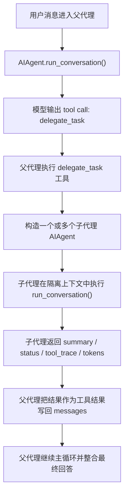

# Hermes-Agent Subagent 机制解析

## 1. 一句话先理解

Hermes 里的 subagent 不是框架自动偷偷开的后台线程，而是父代理在推理过程中，主动调用 `delegate_task` 这个工具，随后框架创建新的 `AIAgent` 子实例，让它在隔离上下文里完成一个聚焦子任务，最后再把摘要结果回传给父代理。

也就是说，它的本质是：

- 父代理负责总控
- 子代理负责局部任务求解
- 子代理的中间过程不污染父代理上下文

---

## 2. 关键源码位置

最核心的文件有这几个：

- `tools/delegate_tool.py`
- `run_agent.py`
- `model_tools.py`
- `agent/memory_manager.py`

如果只看 subagent 机制，优先顺序建议是：

1. `tools/delegate_tool.py`
2. `run_agent.py`
3. `agent/memory_manager.py`

---

## 3. 整体调用链

### 主流程

### 更准确的源码级链路

1. 父代理主循环在 `run_agent.py` 的 `run_conversation()` 中运行
2. 模型如果判断子任务适合委托，会输出 `delegate_task`
3. `run_agent.py` 在工具分发时识别到 `delegate_task`
4. 跳转到 `tools/delegate_tool.py` 的 `delegate_task()`
5. `delegate_task()` 调用 `_build_child_agent()` 创建子代理
6. 再调用 `_run_single_child()` 真正运行子代理
7. 子代理内部继续调用自己的 `run_conversation()`
8. 子代理结束后，只把结构化结果返回给父代理
9. 父代理把这个结果作为一条 tool result 加回主对话

---

## 4. Subagent 是怎么被触发的

Hermes 没有写死“遇到某类任务必开子代理”，而是把 delegation 做成了一个正式工具：

- 工具名：`delegate_task`
- 注册位置：`tools/delegate_tool.py`

这意味着：

- 是否使用 subagent，首先由模型自己判断
- 一旦模型决定委托，就会像调用其他工具一样调用 `delegate_task`

这和普通工具调用的区别在于：

- 普通工具返回的是工具执行结果
- `delegate_task` 返回的是“另一个代理完成子任务后的摘要结果”

可以把它理解成：

- `read_file` 是“去读文件”
- `terminal` 是“去执行命令”
- `delegate_task` 是“去叫一个小代理单独做这件事”

---

## 5. 子代理是怎么创建的

### 创建入口

核心函数：

- `_build_child_agent()` in `tools/delegate_tool.py`

这个函数会真正实例化一个新的 `AIAgent(...)`。

### 创建时做了什么

它不是简单复制父代理，而是做了“受控继承 + 能力裁剪”：

- 为子代理生成独立的 system prompt
- 为子代理指定独立工具集
- 默认跳过记忆系统
- 默认跳过 context files
- 给子代理单独的迭代预算
- 把子代理的进度回传给父代理显示层

### 子代理拿到的专属 system prompt

来源函数：

- `_build_child_system_prompt()` in `tools/delegate_tool.py`

这个 prompt 的核心意思是：

- 你是一个 focused subagent
- 你只负责当前这一个子任务
- 你不知道父代理的完整上下文
- 任务完成后要返回简洁总结

这说明 Hermes 的 subagent 不是“把父代理上下文整包复制一份继续聊”，而是“带着明确 goal/context 开一个新的聚焦执行体”。

---

## 6. 子代理和父代理隔离到什么程度

源码顶部文档已经明确写了子代理特性：

- 独立 conversation
- 独立 task_id
- 独立 terminal session
- 独立工具集
- 独立 focused prompt

实际效果是：

1. 子代理看不到父代理完整历史
2. 父代理也看不到子代理中间 tool call 和中间 reasoning
3. 父代理最终只收到“摘要结果”

这样做的核心价值是两个：

- 防止父上下文爆炸
- 把子任务执行过程压缩成摘要，再回流给父代理

这正是 subagent 存在的意义。

# 7. 子代理为什么不会无限递归

Hermes 对 delegation 做了两层限制。

### 限制 1：直接屏蔽 `delegate_task`

在 `tools/delegate_tool.py` 里定义了：

- `DELEGATE_BLOCKED_TOOLS`

其中明确禁止子代理使用：

- `delegate_task`
- `clarify`
- `memory`
- `send_message`
- `execute_code`

所以子代理天然拿不到再次委托的能力。

### 限制 2：深度限制

同一文件里还有：

- `MAX_DEPTH = 2`

含义是：

- 父代理深度是 `0`
- 子代理深度是 `1`
- 再往下就拒绝

也就是说，Hermes 默认设计就是：

- 允许父代理开子代理
- 不允许子代理再无限套娃

---

## 8. 子代理为什么不能直接和用户交互

`clarify` 被明确列入 blocked tools。

设计原因很直接：

- 只有父代理是用户交互主入口
- 子代理只负责执行
- 避免多个子代理同时向用户提问，造成交互混乱

所以 Hermes 的交互职责是集中式的：

- 父代理负责对外沟通
- 子代理负责对内执行

---

## 9. 子代理为什么不能写 memory

`memory` 也被列入 blocked tools。

这意味着子代理不能直接写共享记忆。

这样设计主要是为了防止：

- 多个子代理并发写记忆
- 子代理把中间态、噪声结论直接污染全局记忆

Hermes 更偏向这种做法：

- 子代理先完成任务
- 父代理观察子代理结果
- 再由父代理侧或 memory manager 做统一记忆处理

这是一种“集中式记忆治理”策略。

---

## 10. 子代理的工具集怎么确定

子代理不会自动继承所有工具，而是要经过筛选。

核心逻辑在：

- `_build_child_agent()` in `tools/delegate_tool.py`

规则是：

1. 如果调用 `delegate_task` 时显式指定了 `toolsets`
   子代理优先按这个来
2. 但即使指定了，也必须和父代理当前可用工具做交集
3. 然后再剔除 blocked tools

关键设计思想是：

- 子代理绝不能获得比父代理更高的权限

源码里实际上就是这个意思：

- subagent must not gain tools the parent lacks

所以 subagent 不是“能力增强版代理”，而是“能力收缩版、上下文隔离版代理”。

---

## 11. 子代理是怎么运行的

真正运行子代理的函数是：

- `_run_single_child()` in `tools/delegate_tool.py`

它做的事情可以拆成 6 步。

### 第 1 步：真正调用子代理主循环

它会执行：

- `child.run_conversation(user_message=goal)`

也就是说，子代理本质上还是同一个 `AIAgent` 内核，只是带着不同上下文和不同权限运行。

### 第 2 步：维持父代理“活着”

它会启动一个 heartbeat 线程，定时回写父代理活动状态。

目的：

- 防止 gateway 误判父代理长时间无活动而超时

因为 delegation 期间，父代理表面上像是“卡住不动”，实际上子代理正在工作。

### 第 3 步：把子代理进度回传给父代理

用到：

- `_build_child_progress_callback()`

作用：

- CLI 模式下，在父代理 spinner 上方显示子代理工具进度
- Gateway 模式下，把子代理的进度做成摘要事件回传

这就解释了一个很关键的体验：

- 父代理虽然拿不到子代理完整中间上下文
- 但可以拿到适量的进度提示

### 第 4 步：收集结构化执行结果

子代理结束后，会抽取这些信息：

- `summary`
- `status`
- `api_calls`
- `duration_seconds`
- `model`
- `exit_reason`
- `tokens`
- `tool_trace`

其中 `tool_trace` 还会从子代理消息里反向提取：

- 调用了什么工具
- 参数大小
- 结果大小
- 是否报错

### 第 5 步：将结果返回给父代理

父代理不会收到完整子会话，只会收到摘要后的 JSON 结构。

这是整个 subagent 机制最重要的“压缩回流”设计。

### 第 6 步：清理资源

最后会做：

- 结束 heartbeat
- 释放 credential lease
- 从 active_children 列表移除
- 关闭 child agent

这是为了防止：

- 子代理的终端资源残留
- 浏览器资源残留
- 后台连接、client、进程泄漏

---

## 12. 它支持并行 subagent 吗

支持。

`delegate_task()` 有两种模式：

### 单任务模式

传入：

- `goal`
- 可选 `context`
- 可选 `toolsets`

### 批量模式

传入：

- `tasks: [{goal, context, toolsets}, ...]`

如果是批量模式，会使用：

- `ThreadPoolExecutor`

来并行执行多个子代理。

### 并行上限

不是无限并行。

上限来自：

- `_get_max_concurrent_children()`

默认值：

- `3`

配置项：

- `delegation.max_concurrent_children`

也就是说，Hermes 的并行 subagent 机制是“有限并发”的，不会让模型无限开子代理。

---

## 13. 父代理还做了哪些保护

除了 `delegate_task()` 自己限制 batch 数量，父代理主循环里还有一层保护：

- `_cap_delegate_task_calls()` in `run_agent.py`

这个函数的作用是：

- 如果模型在同一轮里发了过多 `delegate_task` 调用
- 只保留允许的数量
- 多余的委托直接裁掉

这说明 Hermes 做了双层防护：

1. `delegate_task()` 内部限制一次 batch 的并发数量
2. 父代理层限制同一轮总共能发多少个 delegation 调用

这样可以防止模型“激动过头”，一下子开出过多子代理。

---

## 14. 子代理用什么模型

默认情况下，子代理通常继承父代理的模型与 provider。

但 Hermes 也支持给 delegation 单独配置：

- `delegation.model`
- `delegation.provider`
- `delegation.base_url`
- `delegation.api_key`
- `delegation.reasoning_effort`

对应逻辑在：

- `_resolve_delegation_credentials()` in `tools/delegate_tool.py`

这意味着你可以让：

- 父代理跑贵一点、强一点的模型
- 子代理跑便宜一点、快一点的模型

这是一种典型的“主代理强、子代理快”的成本优化策略。

---

## 15. 子代理的结果怎么回到父代理

父代理并不会把子代理会话原样塞回自己的消息历史。

它拿到的是 `delegate_task()` 返回的 JSON 结果，然后作为一条普通 tool result 加进主对话。

这样父代理在下一轮看到的是：

- 某个 delegation 工具执行完成了
- 返回了 summary / status / tool_trace / tokens

然后父代理再决定：

- 要不要基于这个结果继续推理
- 要不要再补充说明
- 要不要继续调用其他工具
- 要不要直接给用户最终答复

所以子代理在父代理眼里，更像一个“外包求解器”。

---

## 16. 子代理的结果会不会进入记忆系统

会，但不是“子代理自己直接写”。

在 `delegate_task()` 结束后，有一段逻辑会通知父代理的 memory manager：

- `parent_agent._memory_manager.on_delegation(...)`

位置：

- `tools/delegate_tool.py`
- `agent/memory_manager.py`

这意味着：

- 子代理结果会作为“父代理观察到的一次 delegation 事件”进入记忆体系
- 而不是由子代理直接写共享记忆

这样做更稳定，也更符合“父代理总控”的设计原则。

---

## 17. 为什么 Hermes 要用 subagent

从源码设计看，主要有 4 个目的。

### 1. 避免上下文膨胀

如果一个复杂任务的中间过程全留在父代理上下文中，很快就会爆。

subagent 的做法是：

- 中间过程留在子会话
- 最后只回传摘要

### 2. 支持并行化

两个独立研究任务、两个独立分析任务，可以并行跑，不必串行等待。

### 3. 做任务分工

父代理负责全局规划，子代理负责局部深入处理。

### 4. 提升主代理可读性

父代理最后只看到：

- 结论
- 关键过程摘要
- 少量元信息

而不是成百上千行中间输出。

---

## 18. 用面试语言怎么回答

如果面试官问：“Hermes 的 subagent 是怎么实现的？”

可以回答：

Hermes 把子代理机制实现为一个正式工具 `delegate_task`。父代理在推理过程中如果判断某个子任务适合委托，就会调用该工具。框架随后在 `tools/delegate_tool.py` 中创建新的 `AIAgent` 子实例，并为其配置独立上下文、独立终端会话、受限工具集和聚焦任务提示词。子代理不能递归再开子代理，也不能直接和用户交互或写共享记忆。执行完成后，子代理只把摘要结果、状态、token 信息和工具轨迹回传给父代理，父代理再把它作为工具结果并入主循环继续推理。这个设计的目标是并行化复杂任务，同时避免子任务的中间过程污染父代理上下文。

---

## 19. 学习 subagent 源码的推荐顺序

### 第一阶段：看工具入口

先看：

- `tools/delegate_tool.py`

重点函数：

- `_build_child_system_prompt()`
- `_build_child_progress_callback()`
- `_build_child_agent()`
- `_run_single_child()`
- `delegate_task()`

### 第二阶段：看父代理如何接住 delegation

再看：

- `run_agent.py`

重点函数 / 片段：

- `run_conversation()` 中的工具调用处理
- `delegate_task` 分发逻辑
- `_cap_delegate_task_calls()`
- interrupt 向子代理传播的逻辑

### 第三阶段：看记忆观察与资源收尾

再看：

- `agent/memory_manager.py`

重点关注：

- `on_delegation(...)`

---

## 20. 最后一句总结

Hermes 的 subagent 机制，本质上不是“多代理自由协作”，而是“父代理主控、子代理受控执行、结果摘要回流”的委托模型。

它的核心思想是：

- 隔离上下文
- 收缩权限
- 并行执行
- 摘要回流
- 父代理总控

如果你能把这五点讲清楚，就已经真正理解 Hermes 的 subagent 设计了。
